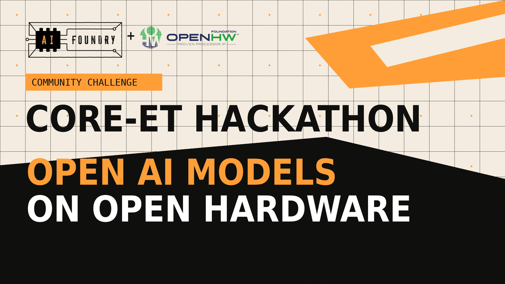
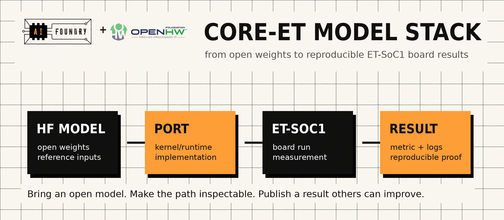

{width=6.5in}

# 🚀 Join the AIFoundry + OpenHW CORE-ET Hackathon

**Port open AI models. Run them on an open hardware platform. Share the proof.**

We are launching the AIFoundry + OpenHW CORE-ET Hackathon: a community challenge for builders who want open AI models to run on open hardware, with results that anyone can inspect, reproduce, and improve.

The mission is practical. Choose a useful open model, kernel, benchmark, or demo. Make it run on ET-SoC1 boards. Measure it on real board infrastructure. Share a reproducible result the next builder can build on.

If you care about open AI, open hardware, robotics, drones, local language models, speech, vision, or systems optimization, this is a chance to turn a model port into a concrete artifact: **model, board, metric, proof.**

## 🔧 Why this hackathon exists

Open AI should not stop at model cards, desktop demos, and closed deployment stacks. We want an inspectable path from model weights to kernels, runtime behavior, board execution, and measured results.

We want to know:

- Which open models run on CORE-ET using ET-SoC1 boards?
- What code, runtime, or kernel changes were needed?
- What performance and accuracy tradeoffs show up on hardware?
- Can another participant reproduce the result?
- Can the next participant make it better?

That is the point of this hackathon: build a shared open-model-on-open-hardware stack for CORE-ET, grow a leaderboard from real ET-SoC1 board runs, and make open AI systems easier to compare across the whole stack.

{width=6.5in}

## 👥 Who should join

This is for:

- Model builders who want to see their work touch open hardware.
- Kernel and systems engineers who want measurable optimization targets.
- Robotics and drone builders looking for transparent AI deployment paths.
- Speech, audio, and vision hackers who like practical benchmarks.
- Researchers, students, and hobbyists who want a focused open AI + open hardware challenge.
- Teams that want a concrete weekend-to-week project with visible results.

You can join solo or bring teammates.

## 🧭 Pick a quest

| Quest | What to build |
|---|---|
| 👁️ Vision | Denoising, detection, and camera-first open model workloads |
| 🎙️ Speech + audio | Whisper-style kernels and streaming-friendly pipelines |
| 🧠 Local LLMs | GGUF and `llama.cpp`-style runtime paths |
| 🤖 Robotics + drones | Perception, control, and hardware-aware model ports |
| ⚙️ Systems | Faster kernels, memory movement, board runners, profiling |
| 🧪 Wildcard | Bring your own open model and make the benchmark reproducible |

## ✅ What counts as a good submission

Good submissions make an open model, kernel, runtime path, or benchmark more useful on CORE-ET and the ET-SoC1 board runners.

That can mean:

- Porting a new open model.
- Improving an existing DnCNN, YOLO, Whisper, or LLM benchmark.
- Making a kernel faster and documenting the board result.
- Adding a reproducible benchmark around a real robotics, drone, speech, or vision workload.
- Packaging a small demo that shows why the model port matters.
- Helping make an existing result easier for others to reproduce.
- Sharing a reusable `.md` recipe or agent-readable notes so another person or agent can repeat the path.

Think of your submission as a short technical pitch: what changed, why it matters, how to reproduce it, and what the board result says.

## 🧩 Show your workflow

We want to see how you approached the task, not only the final number. Good submissions include the trail that made the result possible:

- The task breakdown you followed.
- The `.md` instructions, recipes, or agent notes you used.
- The repos, files, RTL, docs, models, and benchmark artifacts you pointed tools or agents at.
- The commands that worked and the checks that proved correctness.
- The dead ends, failed assumptions, or debugging notes that would save the next participant time.

This can be a short markdown recipe, a `SKILLS.md`-style file, an agent playbook, or notes inside your port folder. The exact format matters less than making the flow reusable.

## 🛠️ How participation works

1. Join the Hugging Face organization.
2. Pick an open model, kernel, benchmark, or demo target.
3. Use the model repo for examples, docs, benchmark artifacts, and submission instructions.
4. Submit your port or improvement, including the workflow recipe or agent-readable notes that explain how you got there.
5. The ET-SoC1 board workflow runs and comments back with results.
6. Results become part of the shared benchmark trail.

## 🤗 Join the hackathon

First, join the Hugging Face organization so you appear with the rest of the hackathon community and can follow shared resources:

https://huggingface.co/organizations/AIFoundry-hackathon/share/lFEBkpoCildVMScJWZeSpPDGfmpCpOYRHc

Then open the model repo:

https://huggingface.co/AIFoundry-hackathon/hf-hackathon

The model repo is the technical home for examples, docs, benchmark artifacts, and submission instructions.

## 💬 Need help?

Join Discord and ask in `#Lab`:

https://discord.gg/CbSA2umxf6

Post what you want to port, what you already know, whether you want teammates, and whether you need board access.

Let’s make open AI on open hardware concrete: **model, board, metric, proof.**
